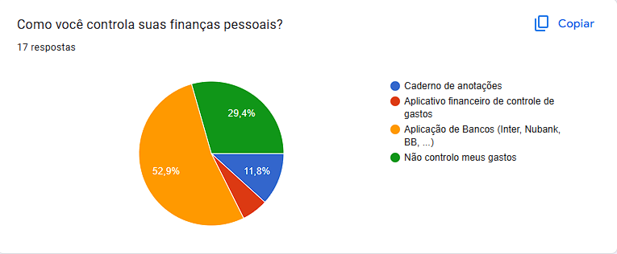
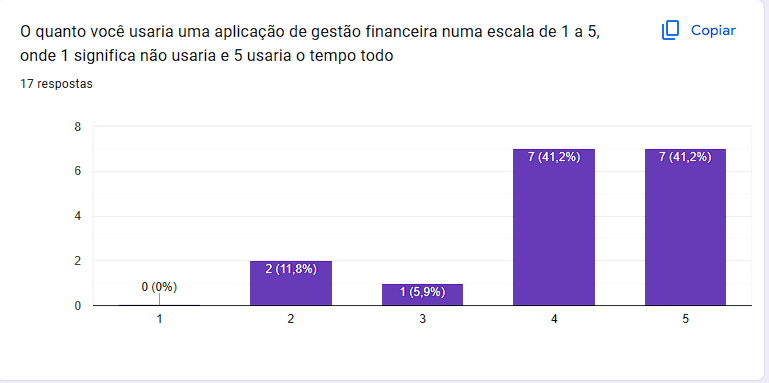

O perfil de usuário é algo importante para todo projeto de software, a partir dele que podemos denifir quem será o nosso principal público alvo para que possamos focar nossos esforços em satisfazer as necessidades deste grupo de pessoas.  

Para definição deste perfil foi utilizado um formulário para ajuda na coleta de dados, mas com um foco maior em uma definição mais ampla do grupo de pessoas que podem utilizar esta aplicação, já que quase todas pessoas precisam controlar suas finanças.  

A seguir temos a tabela 1 com as principais definições do nosso perfil de usuário.

|Dado|Valor|
|:-:|:-:|
|Idade| Acima de 16 anos |
|Localidade| Qualquer região dentro do Brasil|
|Tipo de Cargo| Qualquer cargo ou nenhum|
|Experiência com finanças| De nenhuma a bastante experiência |
<figcaption>Tabela 1: Dados do perfil de usuário</figcaption>

Na figura 1 podemos ver como as pessoas tem controlado seus gastos nos últimos meses.

<figcaption>Figura 1: Análise sobre o controle de finanças</figcaption>

Na figura 2 podesse ver a disponibilidade dos usuários para utilização da aplicação.

<figcaption>Figura 2: Disponilibilidade para uso da aplicação</figcaption>