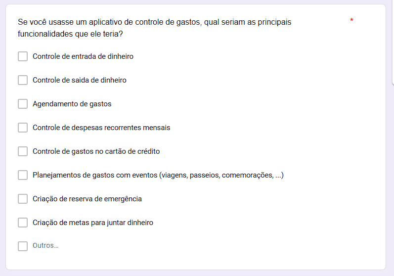
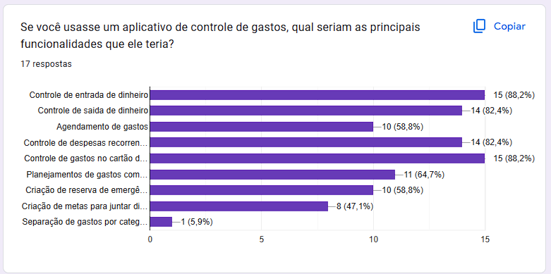

Para realização desta pesquisa de campo, que possui o intuito de validar e definir uma escala de prioridade de uso para funcionalidades, foi desenvolvido um formulário que contava com as principais funcionalidades do sistema elencadas no [brainstorm](https://wildemberg-sales.github.io/gerencia-financeira-pessoal/Elicitacao/brainstorm/) e no artefato de priorização In or Out.  

## Formulário

Na figura 1 pode-se observar a estrutura do formulário criado para o grupo de usuário que continham o perfil de usuário da aplicação, onde cada usuário pode escolhar quantas funcionalidades importantes ele acha que pode haver na aplicação, e ainda há a opção de tal pessoa propor novas funcionalidades.

<figcaption align="center">Figura 1: Formulário desenvolvido para os usuários</figcaption>

Agora, na figura 2, tem-se as respostas fornecidas por 17 usuários, e a partir destas respostas será criado nossa tabela de funcionalidades priorizadas.

<figcaption align="center">Figura 2: Formulário respondido pelos usuários</figcaption>

Portanto podemos notar que existe uma escala de prioridade de uso para os usuário em relação as funcionalidades mostradas, e ainda, uma nova susgestão de funcionalidade que será implementada ao escopo do projeto.  

Agora será desenvolvido o nosso conjunto de [backlog do produto](https://wildemberg-sales.github.io/gerencia-financeira-pessoal/Elicitacao/Modelagem/backlog/), que definirá o escopo do desenvolvimento do projeto. 