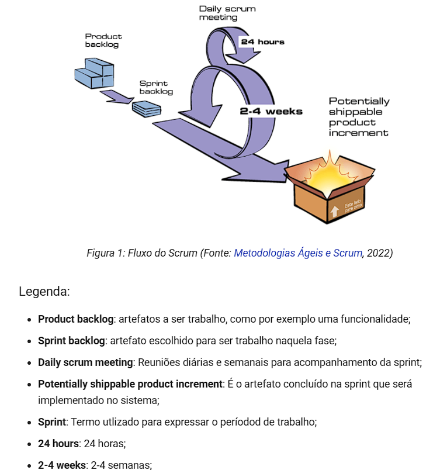

## Modelo de organização
Para desenvolvimento deste projeto, foi escolhido que o desenvolvedor trabalhasse baseado nos princípios da metodoliga ágil do Scrum, focando em entregas e processos rápidos e contínuos.  
O Scrum é um framework para desenvolvimento ágil tanto de software como de outras áreas. Derivado do manifesto ágil, se tornou o principal a ser utilzado para a organização e gerencia de grandes projetos, visando sempre a otimização do time, e entregas rápidas e contínuas de releases.

A seguir vemos na figura 1 o modelo de trabalho no scrum.



Pensando no modelo de entrega rápida foi definido que as sprints durariam de 1 a 2 semanas(a depender da carga horária livre do desenvolvedor), sendo que tais sprints só poderiam ser fechadas quando fossem entregues as funcionalidades completas definidas para a sprint e os testes nescessários para tais, sendo que, caso não seja entregue a funcionalidade com sua suit de testes, se tornará pendência técnica que será retratada na próxima sprint ou em uma sprint específica para correções.

## Políticas de commit
Para maior organização do projeto, será definido um conjunto de mensagens pré-definidas para que cada commit enviado para o repositório no github, esteja bem explicado e explícito sobre o que se trata tal envio.  

### Feature 
```git
git commit -m "feat: o que foi adicionado"
```

### Teste
```git
git commit -m "test: o que foi adicionado"
```

### Correção de Bug
```git
git commit -m "fix: o que foi adicionado"
```

## Referências
> Site metodologias ágeis - <a href="https://www.metodologiaagil.com">www.metodologiaagil.com</a>